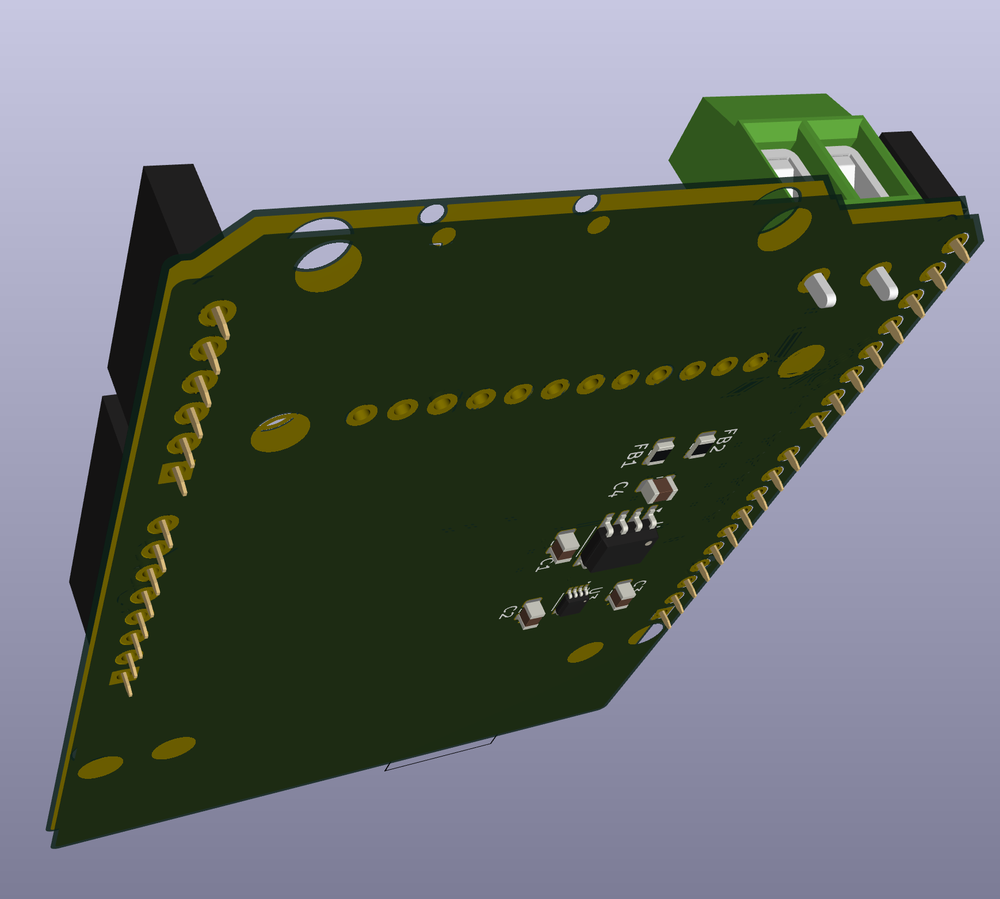

# Arduino K-Type Thermocouple Shield

  

## Description

Arduino Uno shield designed to interface with K-type thermocouples using the MAX31855 cold-junction compensated thermocouple-to-digital converter.

## Features

- Compatible with Arduino Uno form factor
- Uses MAX31855 for K-type thermocouple interface
- Display screen with Arduino sketch for displaying temperature
- Temperature range: -200°C to +1350°C

## Repository Contents

- `/hardware` - KiCad project files and custom parts
- `/doc` - documentation and images
- `/bom` - bill of materials spreadsheets
- 

## Hardware Requirements

- Arduino Uno or compatible board
- K-type thermocouple
- This shield PCB

## License

This hardware design is released under the [CERN Open Hardware License v2 - Strongly Reciprocal](https://ohwr.org/cern_ohl_s_v2.txt).

## Contributing

Contributions to improve the design are welcome. Please submit issues and pull requests.

# Credits

Circuit inspired by [Adafruit #269](https://www.adafruit.com/product/269)
